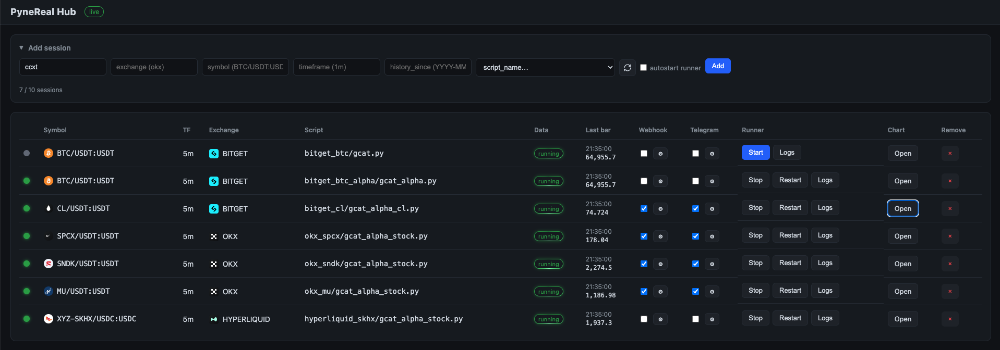

# PyneReal
<p align="center">
  
</p>

Run your crypto trading strategy in real time without TradingView.

## Requirements

- Python 3.11+ (3.14+ recommended)
- **[PyneCore](https://github.com/PyneSys/pynecore)** strategy file under `workdir/scripts`

## Supported Exchanges

Tested in realtime:

- [x] Bitget
- [x] Hyperliquid
- [x] OKX
- [x] Binance
- [x] Bybit

## Supported Timeframes

- [x] 1m and higher
- [ ] Sub-minute timeframes are not supported

## Install

```bash
git clone https://github.com/hackcatml/pynereal
cd pynereal
source setup.sh
```

## Quick Start

Start the hub:

```bash
python data_service/main.py
```

Open the dashboard:

```text
http://127.0.0.1:9001
```

The bundled fallback config creates a demo session for **Bitget BTC/USDT
Futures** on the **1m** timeframe when no `sessions.json` exists.

Then click `Start` in the session row.<br>
The hub starts a dedicated
`runner_service` subprocess for that session and writes its log under
`workdir/output/realtime/<session-id>/runner.log`.<br>
Use `Logs` to inspect the live runner output.<br>
Use `Open` to view the chart.

The demo webhook server is optional:

```bash
python demo_webhook_server.py
```

You'll see webhook alerts when `strategy.entry` or `strategy.close` triggers.

## Files and Directories

```text
pynereal/
|-- data_service/                    Dashboard, chart API, session registry
|-- runner_service/                  Per-session strategy runner process
|-- pynecore/                        Bundled PyneCore runtime package
|-- modules/                         Optional helper modules for strategies
|-- docs/images/                     README screenshots
|-- workdir/
|   |-- scripts/                     Strategy scripts and helper modules
|   |   `-- demo/demo_1m.py          Runnable demo strategy
|   |-- config/
|   |   |-- realtime_trade.toml      Hub defaults and legacy config fallback
|   |   |-- sessions.json            Runtime session state saved by dashboard
|   |   `-- providers.toml           Provider credentials, e.g. ccxt API keys
|   |-- data/                        OHLCV files and per-symbol metadata
|   |   `-- cache/                   SQLite OHLCV cache
|   `-- output/realtime/             Per-session logs, plots, script hashes
|-- demo_webhook_server.py           Optional local webhook receiver
`-- setup.sh                         Local environment setup helper
```

## Strategy Scripts

Place pynecore strategy files anywhere under `workdir/scripts`.<br>
Subdirectories are
supported, and the dashboard keeps the relative path:

```text
workdir/scripts/demo/demo_1m.py -> demo/demo_1m.py
workdir/scripts/okx_mu/my_strategy_5m.py  -> okx_mu/my_strategy_5m.py
```

Only Python files that declare `script.strategy(...)` are shown in the script
selector. Helper modules, `lib`, hidden directories, and `__pycache__` are
excluded.

## Session Configuration

The dashboard is the recommended way to manage sessions. It persists them to:

```text
workdir/config/sessions.json
```

On startup, session loading order is:

1. `workdir/config/sessions.json`
2. `[[session]]` entries in `workdir/config/realtime_trade.toml`
3. Legacy single `[realtime]` section in `realtime_trade.toml`

Example `[[session]]` fallback:

```toml
[hub]
host = "0.0.0.0"
port = 9001

[[session]]
provider = "ccxt"
exchange = "bitget"
symbol = "BTC/USDT:USDT"
timeframe = "1m"
history_since = "2026-06-10"
script_name = "demo/demo_1m.py"
autostart_runner = false

[session.webhook]
enabled = false
url = ""
telegram_notification = false
telegram_token = ""
telegram_chat_id = ""
```

If `[hub]` is absent, the hub falls back to legacy
`[realtime].data_service_addr`.

## Historical Data

When a feed starts, PyneReal prepares an OHLCV file under `workdir/data`.

- If `history_since` is set, PyneReal backfills from that date.
- If `history_since` is empty and there is no existing cache/file, the default
  window is one month for `1m`, and two months for other timeframes.
- If the SQLite cache already contains older bars, regenerated `.ohlcv` files
  may include the cached range.
- Recent closed candles are refreshed from the exchange before runner
  calculation so the strategy uses exchange-confirmed OHLCV where available.

Supported exchange behavior is handled per exchange.<br>
For example, **OKX**, **Binance**, and
**Bybit** zero-volume candles are **hidden** to match TradingView, while **Bitget** and
**Hyperliquid** zero-volume candles remain **visible**.

## Running a Strategy

Prepare a [PyneCore](https://github.com/PyneSys/pynecore) strategy file first.
PyneReal runs PyneCore strategy scripts in realtime, so the file should declare
`script.strategy(...)` and be valid in PyneCore before you start the runner.

1. Put the strategy under `workdir/scripts`.
2. Start the hub with `python data_service/main.py`.
3. Add or select the session in the dashboard.
4. Click `Start`.
5. Open the chart with `Open`.
6. Check runner output with `Logs`.

The runner can be started before opening a chart, or the chart can be opened
before the runner starts. Source code, script title, and alert toggles are still
available from the chart page.

## Strategy Calculation Timing

When a new candle is confirmed, the runner updates the latest OHLCV data and
then executes the strategy for that confirmed bar.<br>
Strategy execution itself is
normally fast; even complex strategies usually finish in less than 100 ms on a
typical local machine.

If webhook alerts are configured, `strategy.entry` and `strategy.close` alerts
are emitted immediately after the strategy calculation produces the signal.<br>
End-to-end order arrival depends on webhook server latency, network latency, and
the target exchange API, but in a normal low-latency setup the order usually
reaches the exchange in less than one second after candle confirmation.

## Webhook and Telegram

Webhook and Telegram settings are per session.

- Toggle Webhook or Telegram from the dashboard row or chart page.
- Use the gear button on the dashboard to set the webhook URL or Telegram
  token/chat id.
- Settings are persisted in `sessions.json`.
- Strategy `alert_message` is sent as the alert message payload.
- Realtime strategy alerts are currently emitted for `strategy.entry` and
  `strategy.close`. `strategy.exit` alerts are not supported yet.

Example:

```python
strategy.entry(
    "Long 1",
    strategy.long,
    alert_message=f'{{"signal": "Long 1", "price": {close}}}',
)
```

If a session-specific Telegram token or chat id is empty, PyneReal falls back to
the root `.env` values below. These values are used only when Telegram sending is
enabled for strategy alerts, or when a manual alert is sent and the session does
not define its own Telegram credentials.

```env
BOT_TOKEN=your_bot_token
CHAT_ID=your_chat_id
```

## Manual Alerts

Manual alerts let you send one-off webhook messages directly from the chart.
They are useful when you want discretionary control in addition to fully
automated strategy alerts.

Open a chart, click the alert menu gear, and configure **Manual Alert
Templates**. Each template has a `TITLE` and a JSON `MESSAGE`. Templates are
stored with the session, so they are shared between desktop and mobile browsers.

To send a manual alert:

1. Double-click the chart on desktop, or double-tap it on mobile.
2. Choose a template from the manual alert menu.
3. Drag the menu if you need to adjust the selected chart price.
4. Click `Send` and confirm the webhook URL.

Manual alerts are independent from the Webhook checkbox. The checkbox controls
strategy-generated alerts only; a manual alert can still be sent while the
checkbox is off. A valid webhook URL is still required. PyneReal sends the final
JSON message directly to that URL.

If Telegram credentials are configured for the session, or through the root
`.env` fallback, PyneReal also sends a Telegram manual-alert message after the
webhook send succeeds. This does not depend on the Telegram checkbox.

Supported placeholders:

- `{{price}}`: the selected chart price. Drag the manual alert menu to adjust it.
- `{{market}}`: the latest live price at the final `Send` click.
- `{{time}}`: the chart time under the cursor, or the latest bar time if unavailable.
- `{{symbol}}`: the session symbol, for example `BTC/USDT:USDT`.
- `{{ticker}}`: alias of `{{symbol}}`, kept for template readability.
- `{{exchange}}`: the session exchange id, for example `okx` or `bitget`.
- `{{timeframe}}`: the session timeframe, for example `1m` or `5m`.
- `{{title}}`: the selected template title.

Use raw placeholders for numeric JSON values and quoted placeholders for string
values:

```json
{"signal":"LONG 1","price":"{{market}}","title":"{{title}}"}
```

```json
{"signal":"CLOSE TP3","ticker":"{{ticker}}","timeframe":"{{timeframe}}"}
```

## Backtesting

Backtesting still uses the PyneCore CLI. It does not require the hub.

Download data:

```bash
pyne data download ccxt --symbol "BITGET:BTC/USDT:USDT" --timeframe 1 --from "2026-06-01"
```

Before running `pyne run`, set realtime mode off in the PyneCore configuration
so the script runs as a normal backtest instead of trying to use the realtime
runner path:

```toml
# realtime_trade.toml

[pyne]
no_report = false

[realtime]
enabled = false
```

Run a strategy:

```bash
pyne run workdir/scripts/demo/demo_1m.py workdir/data/ccxt_BITGET_BTC_USDT_USDT_1.ohlcv
```

## request.security

`request.security` is supported in backtesting and realtime runs.<br>
It behaves similarly to TradingView's `request.security`, but PyneReal currently
supports higher-timeframe requests only.<br>
As with TradingView, lookahead and
higher-timeframe alignment can introduce repainting behavior if the strategy is
written that way.

```python
from pynecore.lib import request, syminfo, low, close, ta, barmerge

macro_low = request.security(
    syminfo.tickerid,
    "1D",
    low[2],
    lookahead=barmerge.lookahead_on,
)

_, _, bb_5_lower = request.security(
    syminfo.tickerid,
    "5",
    ta.bb(close, 20, 2),
    lookahead=barmerge.lookahead_on,
)
```

See `workdir/scripts/demo/demo_1m.py` for a runnable example.

## Custom Inputs

For values that should be computed outside the strategy, use
`strategy.get_custom_inputs()` and wire the values in the runner/backtest code.
The `modules` directory contains examples such as:

- `modules/request_security.py`
- `modules/weekly_hl_calc.py`
- `modules/bb1d_calc.py`

Search for `module calculation` in:

- `pynecore/cli/commands/run.py` for backtesting
- `runner_service/main.py` for realtime

## Mobile Usage

The dashboard is usable from a mobile browser as well as from a desktop
browser.<br>
Open the dashboard from the phone with the server IP address:

```text
http://<server-ip>:9001
```

The mobile dashboard provides the same session controls as the desktop view:
start or stop runners, open charts, inspect logs, and manage alert settings.

## Risk Warning

This project is under active development.<br>
Behavior can change, exchange APIs can
fail or timeout, and strategy/runtime mismatches can cause real trading losses.<br>
Backtest thoroughly, compare realtime output against TradingView or exchange
data, and start with small size.<br>
Use at your own risk.

## License

Apache License Version 2.0.

## Acknowledgements

- [PyneCore](https://github.com/PyneSys/pynecore)
- [lightweight-charts](https://tradingview.github.io/lightweight-charts/)
