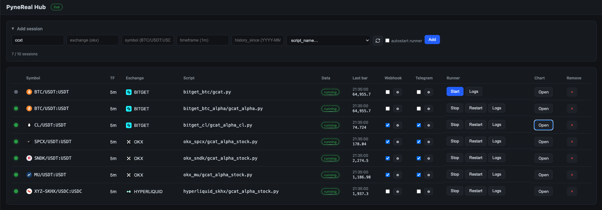

# PyneReal

<p align="center">
  <a href="https://www.python.org/"></a>
  <a href="LICENSE.txt"></a>
</p>

<p align="center">
  
</p>

Run your crypto trading strategy in real time without TradingView.

## ✨ Highlights

- 🤖 **AI copilot** — chat with your running strategies, inspect balances and
  positions across every exchange account, and set price alerts in plain
  language
- ⚡ Realtime [PyneCore](https://github.com/PyneSys/pynecore) strategy runner —
  signal to exchange in under a second after candle confirmation
- 📊 Bitget, Hyperliquid, OKX, Binance, and Bybit supported
- 🔔 Webhook, Telegram, and draggable manual price alerts on the chart
- 💼 **Account Center** — assets, live positions, trade history, net PnL,
  CSV history import, and reviewed internal transfers
- 👁️ **Futures Watchlist** — live prices, 24-hour moves, turnover, favorites,
  and direct session setup across supported exchanges
- 📝 **Scripting workspace** — manage, edit, compare, and restore strategy
  files from the dashboard
- 📱 Full mobile dashboard

## 🤖 AI Copilot

<!-- TODO: record a 10-15s GIF of the AI chat setting a price trigger
     (red trigger line appearing on the chart), save it as
     docs/images/ai-chat.gif, then uncomment:
<p align="center">
  
</p>
-->

Ask the dashboard chat things like:

> "Update the key events for each session"
>
> "Set a take-profit alert on the BTC 1m session at 3% above entry"

The AI copilot can:

- inspect exchange assets and derivative positions — every configured account
  at once when you don't name one;
- set or remove persisted Manual Alert price triggers straight from chat;
- research and maintain a shared calendar for every active trading session;
- analyze repository files, running sessions, and public market information;
- send a finished result to Telegram when you ask for it.

And the unique part — **your strategy can talk to the AI too**. When an order
fills, its `ai` instruction runs automatically:

```python
strategy.entry(
    "Long 3",
    strategy.long,
    alert_message=f'{{"signal": "Long 3", "price": {close}}}',
    ai=f"Set the close2 and close3 manual alerts at {avgEntry * 1.003}",
)
```

All account tools are **read-only** — the AI never places or cancels orders,
changes leverage, or mutates account state.
See [AI Setup & Details](#ai-setup--details) for configuration.

## Requirements

- Python 3.11+ (3.14+ recommended)
- **[PyneCore](https://github.com/PyneSys/pynecore)** strategy file under `workdir/scripts`
- Optional AI Copilot: an OpenAI account with Codex access

## Supported Exchanges

Tested in realtime:

- [x] Bitget
- [x] Hyperliquid
- [x] OKX
- [x] Binance
- [x] Bybit

## Supported Timeframes

- [x] 1m and higher
- [ ] Sub-minute timeframes are not supported

## Install

```bash
git clone https://github.com/hackcatml/pynereal
cd pynereal
source setup.sh
```

## Quick Start

Start the hub:

```bash
python data_service/main.py
```

Open the dashboard:

```text
http://127.0.0.1:9001
```

The bundled fallback config creates a demo session for **Bitget BTC/USDT
Futures** on the **1m** timeframe when no `sessions.json` exists.

Then click `Start` in the session row.<br>
The hub starts a dedicated
`runner_service` subprocess for that session and writes its log under
`workdir/output/realtime/<session-id>/runner.log`.<br>
Use `Logs` to inspect the live runner output.<br>
Use `Open` to view the chart.

The demo webhook server is optional:

```bash
python demo_webhook_server.py
```

You'll see webhook alerts when `strategy.entry` or `strategy.close` triggers.

## Files and Directories

```text
pynereal/
|-- data_service/                    Dashboard, chart API, session registry
|-- runner_service/                  Per-session strategy runner process
|-- pynecore/                        Bundled PyneCore runtime package
|-- modules/                         Optional helper modules for strategies
|-- docs/images/                     README screenshots
|-- workdir/
|   |-- scripts/                     Strategy scripts and helper modules
|   |   `-- demo/demo_1m.py          Runnable demo strategy
|   |-- config/
|   |   |-- realtime_trade.toml      Hub defaults and legacy config fallback
|   |   |-- sessions.json            Runtime session state saved by dashboard
|   |   `-- providers.toml           Provider credentials, e.g. ccxt API keys
|   |-- data/                        OHLCV files and per-symbol metadata
|   |   `-- cache/                   SQLite OHLCV and account-history caches
|   `-- output/realtime/             Per-session logs, plots, script hashes
|-- demo_webhook_server.py           Optional local webhook receiver
`-- setup.sh                         Local environment setup helper
```

## Strategy Scripts

Place pynecore strategy files anywhere under `workdir/scripts`.<br>
Subdirectories are
supported, and the dashboard keeps the relative path:

```text
workdir/scripts/demo/demo_1m.py -> demo/demo_1m.py
workdir/scripts/okx_mu/my_strategy_5m.py  -> okx_mu/my_strategy_5m.py
```

Only Python files that declare `script.strategy(...)` are shown in the script
selector. Helper modules, `lib`, hidden directories, and `__pycache__` are
excluded.

## Scripting Workspace

Open **Scripting** from the Hub menu to manage files under `workdir/scripts`.
The workspace supports creating strategy templates, Markdown files, and
directories, as well as duplicating, renaming, and deleting files or directory
trees. Directory copies exclude hidden files, symbolic links, and
`__pycache__`.

The built-in editor provides undo, comment toggling, find and replace, change
markers, optional revision notes, color-coded diffs, and restoration of earlier
versions. Revision history is stored locally in
`workdir/data/cache/scripting_history.sqlite`.

Files used by a running Runner cannot be renamed or deleted. Saving an active
strategy shows when it will be picked up by the next warm-up; select that status
to restart the affected Runner immediately instead. Deleting a script used only
by stopped sessions clears those sessions' script selection after confirmation.

## Session Configuration

The dashboard is the recommended way to manage sessions. It persists them to:

```text
workdir/config/sessions.json
```

On startup, session loading order is:

1. `workdir/config/sessions.json`
2. `[[session]]` entries in `workdir/config/realtime_trade.toml`
3. Legacy single `[realtime]` section in `realtime_trade.toml`

Example `[[session]]` fallback:

```toml
[hub]
host = "0.0.0.0"
port = 9001

[[session]]
provider = "ccxt"
exchange = "bitget"
symbol = "BTC/USDT:USDT"
timeframe = "1m"
history_since = "2026-06-10"
script_name = "demo/demo_1m.py"

[session.webhook]
enabled = false
url = ""
telegram_notification = false
telegram_token = ""
telegram_chat_id = ""
```

If `[hub]` is absent, the hub falls back to legacy
`[realtime].data_service_addr`.

## Historical Data

When a feed starts, PyneReal prepares an OHLCV file under `workdir/data`.

- If `history_since` is set, PyneReal backfills from that date.
- If `history_since` is empty and there is no existing cache/file, the default
  window is one month for `1m`, and two months for other timeframes.
- If the SQLite cache already contains older bars, regenerated `.ohlcv` files
  may include the cached range.
- Recent closed candles are refreshed from the exchange before runner
  calculation so the strategy uses exchange-confirmed OHLCV where available.

Supported exchange behavior is handled per exchange.<br>
For example, **OKX**, **Binance**, and
**Bybit** zero-volume candles are **hidden** to match TradingView, while **Bitget** and
**Hyperliquid** zero-volume candles remain **visible**.

### Re-sync Historical Data

Open a session's **Data** settings to change its `Data start (UTC)` value after
the session has been created. Saving a new date or datetime re-syncs the cached
market data and regenerated OHLCV file from that boundary. Sessions that share
the same exchange, symbol, and timeframe use the same feed, so the new boundary
applies to all of them.

Running strategies on the affected feed are stopped before the data file is
updated and restarted after it is ready. They then replay the new historical
window to rebuild chart plots and strategy state. Webhook, Telegram, and AI
notifications are suppressed during this re-sync replay so historical signals
are not delivered as new alerts.

## Running a Strategy

Prepare a [PyneCore](https://github.com/PyneSys/pynecore) strategy file first.
PyneReal runs PyneCore strategy scripts in realtime, so the file should declare
`script.strategy(...)` and be valid in PyneCore before you start the runner.

1. Put the strategy under `workdir/scripts`.
2. Start the hub with `python data_service/main.py`.
3. Add or select the session in the dashboard.
4. Click `Start`.
5. Open the chart with `Open`.
6. Check runner output with `Logs`.

The runner can be started before opening a chart, or the chart can be opened
before the runner starts. Source code, script title, and alert toggles are still
available from the chart page.

## Strategy Calculation Timing

When a new candle is confirmed, the runner updates the latest OHLCV data and
then executes the strategy for that confirmed bar.<br>
Strategy execution itself is
normally fast; even complex strategies usually finish in less than 100 ms on a
typical local machine.

If webhook alerts are configured, `strategy.entry` and `strategy.close` alerts
are emitted immediately after the strategy calculation produces the signal.<br>
End-to-end order arrival depends on webhook server latency, network latency, and
the target exchange API, but in a normal low-latency setup the order usually
reaches the exchange in less than one second after candle confirmation.

## Webhook and Telegram

Webhook and Telegram settings are per session.

- Toggle Webhook or Telegram from the dashboard row or chart page.
- Use the gear button on the dashboard to set the webhook URL or Telegram
  token/chat id.
- Settings are persisted in `sessions.json`.
- Strategy `alert_message` is sent as the alert message payload.
- Realtime strategy alerts are currently emitted for `strategy.entry` and
  `strategy.close`. `strategy.exit` alerts are not supported yet.

Example:

```python
strategy.entry(
    "Long 1",
    strategy.long,
    alert_message=f'{{"signal": "Long 1", "price": {close}}}',
)
```

If a session-specific Telegram token or chat id is empty, PyneReal falls back to
the root `.env` values below. These values are used only when Telegram sending is
enabled for strategy alerts, or when a manual alert is sent and the session does
not define its own Telegram credentials.

```env
BOT_TOKEN=your_bot_token
CHAT_ID=your_chat_id
```

## Manual Alerts

Manual alerts let you send one-off webhook messages directly from the chart.
They are useful when you want discretionary control in addition to fully
automated strategy alerts.

Open a chart, click the alert menu gear, and configure **Manual Alert
Templates**. Each template has a `TITLE`, a JSON `MESSAGE`, and an optional
`AI INSTRUCTION`. Templates are stored with the session, so they are shared
between desktop and mobile browsers.

To send a manual alert:

1. Double-click the chart on desktop, or double-tap it on mobile.
2. Choose a template from the manual alert menu.
3. Drag the menu if you need to adjust the selected chart price.
4. Click `Send` and confirm the webhook URL.

To set a price trigger, enter or adjust the `Price`, choose a template, and
click `Set`. PyneReal keeps each red dotted alert line with the session, so
triggers stay active after the chart is closed or the browser reconnects.
When the live price touches a trigger line, PyneReal sends that line's selected
manual-alert template and then automatically removes that trigger. You can set
multiple triggers, move each one by dragging its alert label on the price axis,
remove one with the label `X`, or use `Send` to send a one-off manual alert
immediately.

When a template has an `AI INSTRUCTION`, PyneReal queues it after the template's
webhook is sent successfully. This applies to both direct `Send` and automatic
price-trigger delivery. The AI receives the exact session and alert context, and
its instruction and result appear in shared dashboard chat as
`[Manual Alert AI]`. The AI instruction is not included in the webhook JSON.
Webhook failure prevents the AI instruction from running; an unavailable or
failed AI service does not roll back a successful webhook.

Manual alerts are independent from the Webhook checkbox. The checkbox controls
strategy-generated alerts only; a manual alert still attempts to send the final
JSON message directly to its configured webhook URL while the checkbox is off.

If Telegram credentials are configured for the session, or through the root
`.env` fallback, PyneReal sends a Telegram manual-alert message after the webhook
attempt finishes. The message reports whether the webhook was sent or failed,
and a webhook failure does not prevent this Telegram notification. This does not
depend on the Telegram checkbox.

The JSON `MESSAGE` and optional `AI INSTRUCTION` support these placeholders:

- `{{price}}`: the selected chart price. Drag the manual alert menu to adjust it.
- `{{market}}`: the latest live price at the final `Send` click.
- `{{time}}`: the chart time under the cursor, or the latest bar time if unavailable.
- `{{symbol}}`: the session symbol, for example `BTC/USDT:USDT`.
- `{{ticker}}`: alias of `{{symbol}}`, kept for template readability.
- `{{exchange}}`: the session exchange id, for example `okx` or `bitget`.
- `{{timeframe}}`: the session timeframe, for example `1m` or `5m`.
- `{{title}}`: the selected template title.

Use raw placeholders for numeric JSON values and quoted placeholders for string
values:

```json
{"signal":"LONG 1","price":"{{market}}","title":"{{title}}"}
```

```json
{"signal":"CLOSE TP3","ticker":"{{ticker}}","timeframe":"{{timeframe}}"}
```

## Futures Watchlist

Open the Hub menu and select **Watchlist** to browse futures markets from
Binance, Bitget, Bybit, OKX, and Hyperliquid. The list updates while it is open
and supports exchange, quote-currency, and Stocks / ETFs / Commodities filters,
search, favorites, and price, 24-hour change, or turnover sorting.

Select a market symbol to add it as a dashboard session. The exchange and symbol
come from the selected Watchlist row; choose the timeframe and UTC history start
date and time in the confirmation dialog. The default history range starts two
months earlier at `00:00` UTC.

Watchlist sessions are initially created without a strategy script. While their
Runner is stopped, select the **Script** value in the dashboard row to assign or
change a strategy. Script changes are blocked while the Runner is starting or
running, and `Start` remains disabled until a script has been selected. Sessions
on the same exchange, symbol, and timeframe share one market-data feed while
still allowing separate strategies.

## Account Center

Open the Hub menu beside the PyneReal Hub title and expand **Account**. Account
Center combines every exchange account configured in
`workdir/config/providers.toml`:

- **Assets** shows totals by exchange and account. Select an account to open a
  donut chart with its asset and account-type breakdown, including supported
  spot, futures, margin, funding, and earn balances.
- **Positions** shows current derivative positions with mark price, unrealized
  and realized PnL, return, leverage, margin mode, and liquidation price. Live
  exchange streams update supported values, with periodic REST reconciliation.
- **PnL** groups account results by exchange for `7D`, `30D`, `90D`, `6M`, `1Y`,
  or all locally available history. Net realized PnL includes available trading
  fees and funding; the UI marks incomplete breakdowns when an exchange source
  does not expose every component.
- **History** provides exchange- and symbol-grouped Position History and Order
  History with manual refresh and local pagination.

Recent account history is collected in the background and stored locally in
`workdir/data/cache/account_cache.sqlite`. The initial API backfill targets the
latest 90 days where the exchange permits it. Subsequent collections resume
from overlapping cursors so restarts do not require rebuilding the full cache.

### Import History

Use **Account > History > Import History** to merge older exchange exports into
Position History, Order History, and PnL. Re-importing the same file is allowed,
and imported CSV records take precedence when they provide a more complete
canonical record. Recommended exports are:

- **Binance:** Position History, Order History, Trade History, and Transaction
  History
- **Bitget:** Futures Position History and Futures Order History
- **OKX:** Position History, Order History, and Trade Details
- **Hyperliquid:** Trade History and Funding History; historical orders are
  completed through the Hyperliquid API during import

Bybit accounts remain available in Account Center through supported exchange
APIs, but **Bybit CSV import is not supported yet**.

### Internal Transfers

From **Assets**, select a non-zero account type to open **Internal transfer**.
Available routes depend on the exchange and account configuration. PyneReal
supports transfers between internal wallets, flexible Earn redemption where
available, and main/sub-account transfers where the exchange API permits them.
Every transfer is shown on a review screen and requires explicit confirmation.
This feature does not perform blockchain withdrawals.

Keep API keys read-only when only portfolio viewing is needed. If internal
transfers are required, grant only the minimum account and transfer permissions
for the intended routes; withdrawal permission is not required and should
remain disabled.

## Session Calendar

Open the Hub menu beside the PyneReal Hub title and select **Calendar**. The
monthly view marks dates that have schedules for active sessions; select a date
to see the related symbol, title, details, time, and source.

Select a date and enter a short natural-language event to add it manually. When
AI is enabled, PyneReal verifies the event and resolves its affected sessions
before saving it; optional session selection constrains that research. When AI
is disabled, select the affected sessions and PyneReal stores the entered text
as-is without researching it.

Each event card includes a Pepe forecast control. Select it to run a read-only
AI outlook for that event without opening or modifying the main chat. Pepe's
eyes move while the analysis is running and the face shakes when a new result
is ready. Select the face again to open the Markdown response, or use the
refresh control in the response bubble to run a new outlook.

Calendar events are stored by data-service and shared across desktop and mobile
browsers. Ask Dashboard AI to check or refresh schedules to populate it. A
request without a named session covers every active session and defaults to the
next 90 days. The AI uses SaveTicker calendar titles as discovery leads, searches
the web when no matching title exists, and stores only events whose dates and
details can be supported by a public source.

## AI Setup & Details

PyneReal currently integrates OpenAI Codex through a local Codex app-server and
the dashboard AI chat. It uses the current local Codex login rather than an
OpenAI API key. The Codex runtime is installed automatically by `setup.sh`
through the `openai-codex` dependency, so no separate Codex CLI installation is
required. When no authenticated account is found in an interactive terminal,
data-service asks whether to enable AI and can start device-code login. Before
running data-service non-interactively, start it once in an interactive terminal
and complete that login.

Dashboard AI can:

- inspect exchange assets and derivative positions with the read-only scripts
  under `ai/scripts`;
- query every configured account when no exchange or account is specified;
- analyze repository files, running sessions, and publicly available market
  information;
- set or remove persisted Manual Alert price triggers, including adding a
  missing template when its title and JSON message are explicitly supplied;
- research verified schedules for active sessions and persist them in the
  shared Hub calendar;
- send a completed result to the fixed Telegram destination when explicitly
  requested; and
- edit existing files only under `workdir/`, `modules/`, and
  `data_service/templates/` when explicitly requested, or create new files
  under `tmp/`.

### Exchange Account Access

Put exchange credentials in the local file below if AI should inspect account
balances or positions:

```text
workdir/config/providers.toml
```

The file is created from `providers.example.toml` when missing and is excluded
from Git. Do not commit or print its contents. Grant API keys only the minimum
permissions required for the intended lookup or internal transfer.

```toml
[ccxt.binance]
apiKey = "your_binance_api_key"
secret = "your_binance_secret"

[ccxt.bitget]
apiKey = "your_bitget_api_key"
secret = "your_bitget_secret"
password = "your_bitget_passphrase"

[ccxt.hyperliquid]
walletAddress = "0x_your_main_account_address"
```

Hyperliquid account inspection requires only the main account's public
`walletAddress`. PyneReal treats Hyperliquid accounts as read-only in Account
Center and does not support wallet, Spot/Perps, or main/sub-account transfers in
any account abstraction mode. Do not add a main-wallet private key for this
integration.

Multiple accounts on the same exchange can be configured with named account
tables:

```toml
[ccxt_accounts.binance_main]
exchange = "binance"
apiKey = "your_main_api_key"
secret = "your_main_secret"

[ccxt_accounts.binance_sub1]
exchange = "binance"
apiKey = "your_subaccount_api_key"
secret = "your_subaccount_secret"
```

A general asset request checks spot, futures, margin, funding, and supported
earn balances. A general position request checks the supported derivative
markets for every selected account. Unsupported account types and partial API
failures are reported without exposing credentials. These AI account tools are
read-only and do not place or cancel exchange orders.

### Strategy AI Instructions

Realtime `strategy.entry` and `strategy.close` orders can provide an `ai`
instruction. The instruction runs only after the order fills on the latest
confirmed bar and is restricted to the originating session.

```python
strategy.entry(
    "Long 3",
    strategy.long,
    alert_message=f'{{"signal": "Long 3", "price": {close}}}',
    ai=f"Set the close2 and close3 manual alerts at {avgEntry * 1.003}",
)
```

The runner does not wait for the AI response. Strategy instructions run
independently from dashboard chat and from other sessions, while instructions
from the same session run in event order. The instruction and final result are
stored in shared dashboard chat history. Automated instructions are ignored
during historical backtests and skipped when the AI service is disabled.

Values such as `avgEntry` or `close` are not automatically included. Put values
required by the instruction in the `ai` string, usually with an f-string. AI
never invents a missing Manual Alert title or JSON message, but it can create a
missing template when both are explicitly included in the instruction.

## Backtesting

Backtesting still uses the PyneCore CLI. It does not require the hub.

Download data:

```bash
pyne data download ccxt --symbol "BITGET:BTC/USDT:USDT" --timeframe 1 --from "2026-06-01"
```

Before running `pyne run`, set realtime mode off in the PyneCore configuration
so the script runs as a normal backtest instead of trying to use the realtime
runner path:

```toml
# realtime_trade.toml

[pyne]
no_report = false

[realtime]
enabled = false
```

Run a strategy:

```bash
pyne run workdir/scripts/demo/demo_1m.py workdir/data/ccxt_BITGET_BTC_USDT_USDT_1.ohlcv
```

## request.security

`request.security` is supported in backtesting and realtime runs.<br>
It behaves similarly to TradingView's `request.security`, but PyneReal currently
supports higher-timeframe requests only.<br>
As with TradingView, lookahead and
higher-timeframe alignment can introduce repainting behavior if the strategy is
written that way.

```python
from pynecore.lib import request, syminfo, low, close, ta, barmerge

macro_low = request.security(
    syminfo.tickerid,
    "1D",
    low[2],
    lookahead=barmerge.lookahead_on,
)

_, _, bb_5_lower = request.security(
    syminfo.tickerid,
    "5",
    ta.bb(close, 20, 2),
    lookahead=barmerge.lookahead_on,
)
```

See `workdir/scripts/demo/demo_1m.py` for a runnable example.

## Custom Inputs

For values that should be computed outside the strategy, use
`strategy.get_custom_inputs()` and wire the values in the runner/backtest code.
The `modules` directory contains examples such as:

- `modules/request_security.py`
- `modules/weekly_hl_calc.py`
- `modules/bb1d_calc.py`

Search for `module calculation` in:

- `pynecore/cli/commands/run.py` for backtesting
- `runner_service/main.py` for realtime

## Mobile Usage

The dashboard is usable from a mobile browser as well as from a desktop
browser.<br>
Open the dashboard from the phone with the server IP address:

```text
http://<server-ip>:9001
```

The mobile dashboard provides the same session controls as the desktop view:
start or stop runners, open charts, inspect logs, and manage alert settings.

## Risk Warning

This project is under active development.<br>
Behavior can change, exchange APIs can
fail or timeout, and strategy/runtime mismatches can cause real trading losses.<br>
Backtest thoroughly, compare realtime output against TradingView or exchange
data, and start with small size.<br>
Use at your own risk.

## License

Apache License Version 2.0.

## Acknowledgements

- [PyneCore](https://github.com/PyneSys/pynecore)
- [Lightweight Charts](https://tradingview.github.io/lightweight-charts/)
- [CCXT](https://github.com/ccxt/ccxt)
- [OpenAI Codex](https://openai.com/codex/)
- [CodeMirror](https://codemirror.net/)
- [Lezer](https://lezer.codemirror.net/)
