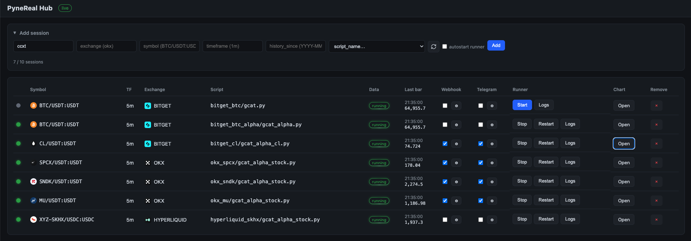

# PyneReal

<p align="center">
  <a href="https://www.python.org/"></a>
  <a href="LICENSE.txt"></a>
</p>

<p align="center">
  
</p>

Run your crypto trading strategy in real time without TradingView.

## ✨ Highlights

- 🤖 **AI copilot** — chat with your running strategies, inspect balances and
  positions across every exchange account, and set price alerts in plain
  language
- ⚡ Realtime [PyneCore](https://github.com/PyneSys/pynecore) strategy runner —
  signal to exchange in under a second after candle confirmation
- 📊 Bitget, Hyperliquid, OKX, Binance, and Bybit supported
- 🔔 Webhook, Telegram, and draggable manual price alerts on the chart
- 💼 **Account Center** — assets, live positions, trade history, net PnL,
  CSV history import, and reviewed internal transfers
- 👁️ **Futures Watchlist** — live prices, 24-hour moves, turnover, favorites,
  and direct session setup across supported exchanges
- 📝 **Scripting workspace** — manage, edit, compare, and restore strategy
  files with CodeMirror 6 and AI-assisted editing; run parallel backtests and
  compare their performance and result charts
- 📱 Full mobile dashboard

## 🤖 AI Copilot

<!-- TODO: record a 10-15s GIF of the AI chat setting a price trigger
     (red trigger line appearing on the chart), save it as
     docs/images/ai-chat.gif, then uncomment:
<p align="center">
  
</p>
-->

Ask the dashboard chat things like:

> "Update the key events for each session"
>
> "Set a take-profit alert on the BTC 1m session at 3% above entry"

The AI copilot can:

- inspect exchange assets and derivative positions — every configured account
  at once when you don't name one;
- set or remove persisted Manual Alert price triggers straight from chat;
- research and maintain a shared calendar for every active trading session;
- analyze repository files, running sessions, and public market information;
- send a finished result to Telegram when you ask for it.

And the unique part — **your strategy can talk to the AI too**. When an order
fills, its `ai` instruction runs automatically:

```python
strategy.entry(
    "Long 3",
    strategy.long,
    alert_message=f'{{"signal": "Long 3", "price": {close}}}',
    ai=f"Set the close2 and close3 manual alerts at {avgEntry * 1.003}",
)
```

All account tools are **read-only** — the AI never places or cancels orders,
changes leverage, or mutates account state.
See [AI Setup & Details](#ai-setup--details) for configuration.

## Requirements

- Python 3.11+ (3.14+ recommended)
- **[PyneCore](https://github.com/PyneSys/pynecore)** strategy file under `workdir/scripts`
- Optional AI Copilot: an OpenAI account with Codex access

## Supported Exchanges

Tested in realtime:

- [x] Bitget
- [x] Hyperliquid
- [x] OKX
- [x] Binance
- [x] Bybit

## Supported Timeframes

- [x] 1m and higher
- [ ] Sub-minute timeframes are not supported

## Install

```bash
git clone https://github.com/hackcatml/pynereal
cd pynereal
source setup.sh
```

## Quick Start

Start the hub:

```bash
python data_service/main.py
```

Open the dashboard:

```text
http://127.0.0.1:9001
```

The bundled fallback config creates a demo session for **Bitget BTC/USDT
Futures** on the **1m** timeframe when no `sessions.json` exists.

Then click `Start` in the session row.<br>
The hub starts a dedicated
`runner_service` subprocess for that session and writes its log under
`workdir/output/realtime/<session-id>/runner.log`.<br>
Use `Logs` to inspect the live runner output.<br>
Use `Open` to view the chart.

The demo webhook server is optional:

```bash
python demo_webhook_server.py
```

You'll see webhook alerts when `strategy.entry` or `strategy.close` triggers.

## Files and Directories

```text
pynereal/
|-- data_service/                    Dashboard, chart API, session registry
|-- runner_service/                  Per-session strategy runner process
|-- pynecore/                        Bundled PyneCore runtime package
|-- modules/                         Optional helper modules for strategies
|-- docs/images/                     README screenshots
|-- workdir/
|   |-- scripts/                     Strategy scripts and helper modules
|   |   `-- demo/demo_1m.py          Runnable demo strategy
|   |-- config/
|   |   |-- realtime_trade.toml      Hub defaults and legacy config fallback
|   |   |-- sessions.json            Runtime session state saved by dashboard
|   |   `-- providers.toml           Provider credentials, e.g. ccxt API keys
|   |-- data/                        OHLCV files and per-symbol metadata
|   |   `-- cache/                   SQLite OHLCV and account-history caches
|   `-- output/realtime/             Per-session logs, plots, script hashes
|-- demo_webhook_server.py           Optional local webhook receiver
`-- setup.sh                         Local environment setup helper
```

## Strategy Scripts

Place pynecore strategy files anywhere under `workdir/scripts`.<br>
Subdirectories are
supported, and the dashboard keeps the relative path:

```text
workdir/scripts/demo/demo_1m.py -> demo/demo_1m.py
workdir/scripts/okx_mu/my_strategy_5m.py  -> okx_mu/my_strategy_5m.py
```

Only Python files that declare `script.strategy(...)` are shown in the script
selector. Helper modules, `lib`, hidden directories, and `__pycache__` are
excluded.

## Scripting Workspace

Open **Scripting** from the Hub menu to manage files under `workdir/scripts`.
The workspace supports creating strategy and indicator templates, Markdown files, and
directories, as well as duplicating, renaming, and deleting files or directory
trees. Directory copies exclude hidden files, symbolic links, and
`__pycache__`.

On desktop, the workspace can be moved and resized, and the source tree can be
resized or collapsed. Right-click a file or directory for actions; Shift-click
files to select a range for duplication or deletion. On mobile, use each row's
three-dot menu and drag the sheet down to close it.

### Editing and Version History

The CodeMirror 6 editor is shared with the chart Source editor. It provides
line numbers, Python/PyneCore autocompletion, optional word wrap,
undo, comment toggling, find and replace, change
markers, optional revision notes, color-coded diffs, and restoration of earlier
versions. Revision history is stored locally in
`workdir/data/cache/scripting_history.sqlite`.

Use `Cmd/Ctrl + F` to find, `Cmd/Ctrl + R` to find and replace, and
`Cmd/Ctrl + /` to toggle comments. Toolbar controls are also available on mobile.
Code is unwrapped by default; the Word wrap toolbar button toggles soft wrapping
without changing the file. Completion suggestions support imported PyneCore APIs
(including aliases), Python built-ins, and locally declared names. Use
`Ctrl + Space` to request suggestions, `Enter` or `Tab` to accept, and `Escape`
to dismiss; suggestions can also be selected by touch. Required function arguments
are inserted as editable snippet fields. This is not full Python type inference.
CodeMirror is bundled; normal setup and Update do not require Node.js or npm.
Editable CodeMirror source and build tooling live in `data_service/codemirror_build/`;
the browser bundle is generated in `data_service/templates/codemirror.js`.
`npm run build:codemirror` also extracts the bundled PyneCore API names, signatures,
and documentation using Python's AST, without importing or executing strategies.
Completion runs in the browser, without per-keystroke server or AI requests.

Opening or saving a Python file runs static validation, with cached results for
an unchanged revision. Errors are underlined, and the error navigation buttons
move between diagnostics. This checks syntax and supported declarations/imports
without executing the strategy; it does not replace a backtest.

External edits are recorded when the workspace next reads the file. Saving
against an outdated revision reports a conflict instead of overwriting newer
disk contents. Notes can be saved or cleared without changing the source.

Files used by a running Runner cannot be renamed or deleted. Saving an active
strategy shows when it will be picked up by the next warm-up; select that status
to restart the affected Runner immediately instead. Deleting a script used only
by stopped sessions clears those sessions' script selection after confirmation.

### Script AI

With the AI service enabled, open **Script AI** from the editor toolbar to ask
about the current source or request changes. Unsaved edits are included in the
conversation context. AI changes are returned to the editor as an **unsaved
draft**; review them and press Save to update the actual file and version history.

On desktop, the chat is a movable, resizable floating window. On mobile, it opens
as a partial-height sheet; touching the editor behind it dismisses the chat.
File management, editing, validation, and backtesting also work with AI disabled.

### Backtesting

Choose **Backtest** from a Python file's actions or the editor toolbar. Save the
source first, select an OHLCV file and UTC date/time range, then press Run.
Both strategies and indicators can run; performance reports require strategy
output. The data manager can download a new dataset, update one to the present,
or delete an unused dataset. Data used by a registered session or an active
backtest cannot be deleted.

Expand **Inputs** to set values declared with `input.*`. Multiple values produce
all combinations, up to 1,000 runs. At most **10 backtest processes** run at once;
the rest wait in a queue. Identical settings cannot be queued or run twice at the
same time. Rerunning a completed configuration shows its latest result in the
result selector.

Each script has its own backtest window on desktop. Windows can be moved,
resized, and brought to the front independently of the editor and Script AI.
Closing a window does not stop its job; use Stop to cancel a run. Logs stream to
the window and support `Cmd/Ctrl + F` search and first/last-line navigation.

### Results and Comparison

Summary shows net profit, drawdown, trades, win rate, profit factor, commission,
buy-and-hold return, and switchable Sharpe/Sortino ratios. When several summaries
are available, **Compare** displays them as columns in one table. Hover over a
column number, or tap it on mobile, to see that run's input values. The table
keeps metric labels visible while scrolling horizontally on smaller screens.
Each individual summary has a collapsed **Script** section showing the complete
source used by that run; use its copy button to copy it. This section is omitted
from **Compare**. Source snapshots are saved for new runs only.
Older results without a saved snapshot do not display the current script in its place.

**Equity Curve** opens a new chart tab on desktop and mobile, with candles,
strategy plots and markers above the equity curve. Zoom the curve and select a
point to move the price chart to that time. Expand **Max Drawdown** for **Max loss**
and **Max rate**: their maxima are tracked independently and may occur on different
bars. **Drawdown lists** supports sorting by time, loss, or percentage and jumping
to the selected time. The chart also includes the live chart's measurement tools.

Sharpe/Sortino use monthly trade returns and the strategy's risk-free rate.
Unavailable ratios display `-`. Existing result files are not automatically
recalculated after a statistics update; rerun the backtest for the new values.

Results are stored in `workdir/output/backtests/<job_id>/`, including logs,
`strategy.csv`, `trades.csv`, plots, equity data where produced, and the executed
source in `script.py`. Temporary runtime copies are removed after execution.
The delete button beside each result removes only that run after confirmation;
queued or running results cannot be deleted. **Clear** asks for confirmation and
deletes all stored results for the selected script when no jobs are active.

Backtest calculations run in separate processes with Webhook and Telegram
disabled. They do not change the live Runner's `pre_run`/`run_ready` schedule,
but share the host's CPU, memory, and disk. Parallel runs can still compete with
live trading workloads; the 10-process limit is not a guarantee of spare capacity.

## Session Configuration

The dashboard is the recommended way to manage sessions. It persists them to:

```text
workdir/config/sessions.json
```

On startup, session loading order is:

1. `workdir/config/sessions.json`
2. `[[session]]` entries in `workdir/config/realtime_trade.toml`
3. Legacy single `[realtime]` section in `realtime_trade.toml`

Example `[[session]]` fallback:

```toml
[hub]
host = "0.0.0.0"
port = 9001

[[session]]
provider = "ccxt"
exchange = "bitget"
symbol = "BTC/USDT:USDT"
timeframe = "1m"
history_since = "2026-06-10"
script_name = "demo/demo_1m.py"

[session.webhook]
enabled = false
url = ""
telegram_notification = false
telegram_token = ""
telegram_chat_id = ""
```

If `[hub]` is absent, the hub falls back to legacy
`[realtime].data_service_addr`.

## Historical Data

When a feed starts, PyneReal prepares an OHLCV file under `workdir/data`.

- If `history_since` is set, PyneReal backfills from that date.
- If `history_since` is empty and there is no existing cache/file, the default
  window is one month for `1m`, and two months for other timeframes.
- If the SQLite cache already contains older bars, regenerated `.ohlcv` files
  may include the cached range.
- Recent closed candles are refreshed from the exchange before runner
  calculation so the strategy uses exchange-confirmed OHLCV where available.

Supported exchange behavior is handled per exchange.<br>
For example, **OKX**, **Binance**, and
**Bybit** zero-volume candles are **hidden** to match TradingView, while **Bitget** and
**Hyperliquid** zero-volume candles remain **visible**.

### Re-sync Historical Data

Open a session's **Data** settings to change its `Data start (UTC)` value after
the session has been created. Saving a new date or datetime re-syncs the cached
market data and regenerated OHLCV file from that boundary. Sessions that share
the same exchange, symbol, and timeframe use the same feed, so the new boundary
applies to all of them.

Running strategies on the affected feed are stopped before the data file is
updated and restarted after it is ready. They then replay the new historical
window to rebuild chart plots and strategy state. Webhook, Telegram, and AI
notifications are suppressed during this re-sync replay so historical signals
are not delivered as new alerts.

## Running a Strategy

Prepare a [PyneCore](https://github.com/PyneSys/pynecore) strategy file first.
PyneReal runs PyneCore strategy scripts in realtime, so the file should declare
`script.strategy(...)` and be valid in PyneCore before you start the runner.

1. Put the strategy under `workdir/scripts`.
2. Start the hub with `python data_service/main.py`.
3. Add or select the session in the dashboard.
4. Click `Start`.
5. Open the chart with `Open`.
6. Check runner output with `Logs`.

The runner can be started before opening a chart, or the chart can be opened
before the runner starts. Source code, script title, and alert toggles are still
available from the chart page.

## Browser Chart Indicators

The chart's **Indicators** tool enables SMA, EMA, Bollinger Bands, RSI, MACD,
SMI, and VWAP. Each indicator's settings button exposes its periods and colors, plus
the standard-deviation multiplier for Bollinger Bands. MACD defaults to 12/26/9
with MACD/signal lines and a positive/negative histogram. SMI defaults to a
10-bar range with two 3-period EMA smoothings and a 3-period EMA signal line.
Bollinger Bands default to red (upper), blue (basis), and green (lower).
RSI, MACD and SMI each use a separate lower pane that can collapse to a value
row without stopping calculation; values follow the selected candle. Indicators
are off by default. Selections, parameters, colors and collapsed state are saved
per session on the server in `workdir/config/chart_indicators/`, while resized
pane heights remain local to each browser.

After upgrading, reopen the chart in the browser where indicators were configured
to copy its previous local preferences to the server. This initial migration only
runs when that session has no saved server settings; other browsers then load the
server settings when opening the chart. Setting changes are saved on demand,
without polling or additional exchange requests.
If older server settings lack a collapse state, reopening the configured browser
also copies that state to the server.

Telegram and AI screenshots use these saved settings and wait for the indicator
history to finish calculating and rendering. The current-price label is refreshed
before capture without waiting for its one-second timer. Collapsed lower indicator panes stay
collapsed; expanded panes use the capture viewport rather than a phone's pane heights. A settings
or calculation failure is reported instead of silently sending a chart without
the requested indicators.

VWAP uses HLC3 weighted by candle volume and resets at 00:00 UTC. Zero-volume
candles do not add weight. Like other browser indicators, its values depend on
the loaded candles and displayed timeframe; loading missing history recalculates it.

Click the symbol name in the chart header to switch to another registered
session whose chart data is ready. The list includes sessions with stopped
runners and shows the exchange, timeframe and script. It is fetched only when
the menu opens; selecting a session navigates in the current tab.

Indicators use the currently displayed timeframe, including higher-timeframe
OHLCV aggregated in the browser. Switching to a higher timeframe loads enough
original candles from the local server to form an initial 50 higher-timeframe
candles around the viewed time, or all available candles if local history is
shorter. It reuses cached data and requests missing history in 5,000-candle pages;
it does not fetch exchange data or recalculate the strategy. Unread partial
buckets do not count toward the initial 50 candles. This is an initial target,
not a total limit: navigating further loads additional history normally.
Calculations run in a browser Web Worker using
`trading-signals`; live updates replace the current candle instead of replaying
all history. Loading or correcting historical data rebuilds the indicators.
Unread gaps restart the indicator warm-up rather than connecting incomplete
history. Values near the start of the loaded range can change when more history
is loaded, especially for recursively smoothed indicators.

These indicators are chart-only: they do not change strategy calculations,
signals, or alerts, and they do not add exchange requests. They are not a promise
of exact TradingView or PyneCore numerical equivalence. The worker is bundled, so
normal setup and Update do not require Node.js or npm. To rebuild it during
development, run `npm ci` and `npm run build:indicators`; source lives in
`data_service/indicators_build/`.

## Strategy Calculation Timing

When a new candle is confirmed, the runner updates the latest OHLCV data and
then executes the strategy for that confirmed bar.<br>
Strategy execution itself is
normally fast; even complex strategies usually finish in less than 100 ms on a
typical local machine.

If webhook alerts are configured, `strategy.entry` and `strategy.close` alerts
are emitted immediately after the strategy calculation produces the signal.<br>
End-to-end order arrival depends on webhook server latency, network latency, and
the target exchange API, but in a normal low-latency setup the order usually
reaches the exchange in less than one second after candle confirmation.

## Webhook and Telegram

Webhook and Telegram settings are per session.

- Toggle Webhook or Telegram from the dashboard row or chart page.
- Use the gear button on the dashboard to set the webhook URL or Telegram
  token/chat id.
- Settings are persisted in `sessions.json`.
- Strategy `alert_message` is sent as the alert message payload.
- Realtime strategy alerts are currently emitted for `strategy.entry` and
  `strategy.close`. `strategy.exit` alerts are not supported yet.

Example:

```python
strategy.entry(
    "Long 1",
    strategy.long,
    alert_message=f'{{"signal": "Long 1", "price": {close}}}',
)
```

If a session-specific Telegram token or chat id is empty, PyneReal falls back to
the root `.env` values below. These values are used only when Telegram sending is
enabled for strategy alerts, or when a manual alert is sent and the session does
not define its own Telegram credentials.

```env
BOT_TOKEN=your_bot_token
CHAT_ID=your_chat_id
```

## Notification Center

The bell to the right of the Hub clock opens saved strategy/manual alert results
and verification-runner order-signal findings. A red dot indicates unread items.
Expand an item to read its details; the broom marks all unread items as read.
Once all items are read, click the broom again to confirm clearing the list.
Cleared items stay hidden after a refresh or restart; saved history is not deleted.

Strategy alert results are recorded only when the webhook toggle is enabled at
the time of the alert. Previously saved items remain unchanged.
Webhook results appear after the request completes. Telegram results update the
same item separately, so a Telegram timeout does not delay the webhook result.
A webhook response is not proof that a trade executed; receiver statuses such
as `pending` are shown separately. Response timeouts are shown as delivery unknown.
Existing sending toggles and retry policies are unchanged.

History and read state are stored in `workdir/data/cache/notifications.sqlite`.
Notification transport and database writes run outside the strategy calculation
thread. Events not yet saved can be lost if the process is forcibly terminated.

## Manual Alerts

Manual alerts let you send one-off webhook messages directly from the chart.
They are useful when you want discretionary control in addition to fully
automated strategy alerts.

Open a chart, click the alert menu gear, and configure **Manual Alert
Templates**. Each template has a `TITLE`, a JSON `MESSAGE`, and an optional
`AI INSTRUCTION`. Templates are stored with the session, so they are shared
between desktop and mobile browsers.

To send a manual alert:

1. Double-click the chart on desktop, or double-tap it on mobile.
2. Choose a template from the manual alert menu.
3. Drag the menu if you need to adjust the selected chart price.
4. Click `Send` and confirm the webhook URL.

To set a price trigger, enter or adjust the `Price`, choose a template, and
click `Set`. PyneReal keeps each red dotted alert line with the session, so
triggers stay active after the chart is closed or the browser reconnects.
When the live price touches a trigger line, PyneReal sends that line's selected
manual-alert template and then automatically removes that trigger. You can set
multiple triggers, move each one by dragging its alert label on the price axis,
remove one with the label `X`, or use `Send` to send a one-off manual alert
immediately.

When a template has an `AI INSTRUCTION`, PyneReal queues it after the template's
webhook is sent successfully. This applies to both direct `Send` and automatic
price-trigger delivery. The AI receives the exact session and alert context, and
its instruction and result appear in shared dashboard chat as
`[Manual Alert AI]`. The AI instruction is not included in the webhook JSON.
Webhook failure prevents the AI instruction from running; an unavailable or
failed AI service does not roll back a successful webhook.

Manual alerts are independent from the Webhook checkbox. The checkbox controls
strategy-generated alerts only; a manual alert still attempts to send the final
JSON message directly to its configured webhook URL while the checkbox is off.

If Telegram credentials are configured for the session, or through the root
`.env` fallback, PyneReal sends a Telegram manual-alert message after the webhook
attempt finishes. The message reports whether the webhook was sent or failed,
and a webhook failure does not prevent this Telegram notification. This does not
depend on the Telegram checkbox.

The JSON `MESSAGE` and optional `AI INSTRUCTION` support these placeholders:

- `{{price}}`: the selected chart price. Drag the manual alert menu to adjust it.
- `{{market}}`: the latest live price at the final `Send` click.
- `{{time}}`: candle start time in Unix seconds. Direct `Send` uses the latest
  session candle at final confirmation, regardless of the clicked chart position
  or display timeframe. A `Set` trigger uses the candle containing the triggering
  trade; if the trade has no timestamp, it uses the candle containing server time.
  The separate Telegram `Time:` line still shows notification-generation time.
- `{{symbol}}`: the session symbol, for example `BTC/USDT:USDT`.
- `{{ticker}}`: alias of `{{symbol}}`, kept for template readability.
- `{{exchange}}`: the session exchange id, for example `okx` or `bitget`.
- `{{timeframe}}`: the session timeframe, for example `1m` or `5m`.
- `{{title}}`: the selected template title.

Use raw placeholders for numeric JSON values and quoted placeholders for string
values:

```json
{"signal":"LONG 1","price":"{{market}}","title":"{{title}}"}
```

```json
{"signal":"CLOSE TP3","ticker":"{{ticker}}","timeframe":"{{timeframe}}"}
```

## Futures Watchlist

Open the Hub menu and select **Watchlist** to browse futures markets from
Binance, Bitget, Bybit, OKX, and Hyperliquid. The list updates while it is open
and supports exchange, quote-currency, and Stocks / ETFs / Commodities filters,
search, favorites, and price, 24-hour change, or turnover sorting.

Select a market symbol to add it as a dashboard session. The exchange and symbol
come from the selected Watchlist row; choose the timeframe and UTC history start
date and time in the confirmation dialog. The default history range starts two
months earlier at `00:00` UTC.

Watchlist sessions are initially created without a strategy script. While their
Runner is stopped, select the **Script** value in the dashboard row to assign or
change a strategy. Script changes are blocked while the Runner is starting or
running, and `Start` remains disabled until a script has been selected. Sessions
on the same exchange, symbol, and timeframe share one market-data feed while
still allowing separate strategies.

## Account Center

Open the Hub menu beside the PyneReal Hub title and expand **Account**. Account
Center combines every exchange account configured in
`workdir/config/providers.toml`:

- **Assets** shows totals by exchange and account. Select an account to open a
  donut chart with its asset and account-type breakdown, including supported
  spot, futures, margin, funding, and earn balances.
- **Positions** shows current derivative positions with mark price, unrealized
  and realized PnL, return, leverage, margin mode, and liquidation price. Live
  exchange streams update supported values, with periodic REST reconciliation.
- **PnL** groups account results by exchange for `7D`, `30D`, `90D`, `6M`, `1Y`,
  or all locally available history. Net realized PnL includes available trading
  fees and funding; the UI marks incomplete breakdowns when an exchange source
  does not expose every component.
- **History** provides exchange- and symbol-grouped Position History and Order
  History with manual refresh and local pagination.

Recent account history is collected in the background and stored locally in
`workdir/data/cache/account_cache.sqlite`. The initial API backfill targets the
latest 90 days where the exchange permits it. Subsequent collections resume
from overlapping cursors so restarts do not require rebuilding the full cache.

### Import History

Use **Account > History > Import History** to merge older exchange exports into
Position History, Order History, and PnL. Re-importing the same file is allowed,
and imported CSV records take precedence when they provide a more complete
canonical record. Recommended exports are:

- **Binance:** Position History, Order History, Trade History, and Transaction
  History
- **Bitget:** Futures Position History and Futures Order History
- **OKX:** Position History, Order History, and Trade Details
- **Hyperliquid:** Trade History and Funding History; historical orders are
  completed through the Hyperliquid API during import

Bybit accounts remain available in Account Center through supported exchange
APIs, but **Bybit CSV import is not supported yet**.

### Internal Transfers

From **Assets**, select a non-zero account type to open **Internal transfer**.
Available routes depend on the exchange and account configuration. PyneReal
supports transfers between internal wallets, flexible Earn redemption where
available, and main/sub-account transfers where the exchange API permits them.
Every transfer is shown on a review screen and requires explicit confirmation.
This feature does not perform blockchain withdrawals.

Keep API keys read-only when only portfolio viewing is needed. If internal
transfers are required, grant only the minimum account and transfer permissions
for the intended routes; withdrawal permission is not required and should
remain disabled.

## Session Calendar

Open the Hub menu beside the PyneReal Hub title and select **Calendar**. The
monthly view marks dates that have schedules for active sessions; select a date
to see the related symbol, title, details, time, and source.

Select a date and enter a short natural-language event to add it manually. When
AI is enabled, PyneReal verifies the event and resolves its affected sessions
before saving it; optional session selection constrains that research. When AI
is disabled, select the affected sessions and PyneReal stores the entered text
as-is without researching it.

Each event card includes a Pepe forecast control. Select it to run a read-only
AI outlook for that event without opening or modifying the main chat. Pepe's
eyes move while the analysis is running and the face shakes when a new result
is ready. Select the face again to open the Markdown response, or use the
refresh control in the response bubble to run a new outlook.

Calendar events are stored by data-service and shared across desktop and mobile
browsers. Ask Dashboard AI to check or refresh schedules to populate it. A
request without a named session covers every active session and defaults to the
next 90 days. The AI uses SaveTicker calendar titles as discovery leads, searches
the web when no matching title exists, and stores only events whose dates and
details can be supported by a public source.

## AI Setup & Details

PyneReal currently integrates OpenAI Codex through a local Codex app-server and
the dashboard AI chat. It uses the current local Codex login rather than an
OpenAI API key. The Codex runtime is installed automatically by `setup.sh`
through the `openai-codex` dependency, so no separate Codex CLI installation is
required. When no authenticated account is found in an interactive terminal,
data-service asks whether to enable AI and can start device-code login. Before
running data-service non-interactively, start it once in an interactive terminal
and complete that login.

Dashboard AI can:

- inspect exchange assets and derivative positions with the read-only scripts
  under `ai/scripts`;
- query every configured account when no exchange or account is specified;
- analyze repository files, running sessions, and publicly available market
  information;
- set or remove persisted Manual Alert price triggers, including adding a
  missing template when its title and JSON message are explicitly supplied;
- research verified schedules for active sessions and persist them in the
  shared Hub calendar;
- send a completed result to the fixed Telegram destination when explicitly
  requested; and
- edit existing files only under `workdir/`, `modules/`, and
  `data_service/templates/` when explicitly requested, or create new files
  under `tmp/`.

### Telegram AI (Opt-In)

Chart screenshots in both web AI and Telegram require Chrome/Chromium on the
server. On Ubuntu/Debian x86_64, setup installs Chrome for Testing under
`.runtime/chrome-for-testing/` when no existing browser is available. To install
or repair only capture dependencies, run `bash setup.sh --chart-capture-only`
from the PyneReal directory; this does not reinstall Python packages or change
AI sandbox settings. An existing executable can also be selected with
`PYNEREAL_CHROME_PATH`.

Backend updates check this separately after applying the new code, before feeds
and runners resume, including upgrades from an older Updater that already
marked Python dependencies as synced. A working browser is reused without
downloading or running apt. Automated installation never prompts for sudo;
if administrator access or downloads fail, the update continues with a warning
and capture stays unavailable until repaired manually. This host-tool check
does not require an additional backend restart. Ordinary startup, frontend-only
updates and screenshot requests do not install software. Other Linux
architectures/distributions need a compatible browser installed manually.

The existing alert bot can also accept AI requests in a configured
private chat, group or supergroup. Create `workdir/config/telegram_ai.toml` using
`workdir/config/telegram_ai.example.toml`:

```toml
[telegram_ai]
enabled = true
allowed_user_ids = [123456789] # Your numeric Telegram user ID, not a username
idle_timeout_seconds = 900
```

Reception reuses the root `.env` or environment `BOT_TOKEN` and numeric `CHAT_ID`.
For groups, `CHAT_ID` is the negative group/supergroup ID, while
`allowed_user_ids` contains the positive IDs of the people allowed to give
instructions. Both the exact chat and sender must be allowed. Channel posts,
bot messages and messages sent on behalf of a chat (including anonymous admins)
are rejected. Conversation mode, history and cancellation are scoped to each
user within that chat. **AI answers in a group are visible to all its members**,
even those not allowed to give instructions. Enable it on **one server per bot**;
an existing Telegram webhook or another `getUpdates` receiver must not share
the bot. No incoming public port or Telegram webhook endpoint is required.
Restart data-service after configuration changes. Codex AI must be enabled for
AI conversations; `/screenshot`, `/price`, `/assets`, `/positions`, `/sessions`, `/pnl`
and `/alerts` do not require it.

In a group, send `/ai@YourBot current positions` as a new message, using the
bot's actual username. `/end@YourBot` and `/cancel@YourBot` also work. Commands
addressed to another bot are ignored. To continue with ordinary text after `/ai`,
disable Privacy Mode through BotFather's `/setprivacy` and remove/re-add the bot
to the group, or use a bot that is already a group admin. Addressed commands work
without disabling Privacy Mode, so admin permissions are not required for that
workflow. See [Telegram's Privacy Mode documentation](https://core.telegram.org/bots/features#privacy-mode).
If a group is migrated to a supergroup, update `CHAT_ID` to the new ID and restart;
the receiver does not automatically authorize a different destination.

At startup, PyneReal registers `/ai`, `/screenshot`, `/price`, `/assets`, `/positions`,
`/sessions`, `/pnl`, `/alerts`, `/model`, `/new`, `/cancel`, `/end` and `/help`
for the configured chat via Telegram's
[`setMyCommands`](https://core.telegram.org/bots/api#setmycommands).
Typing `/` shows their descriptions without manual BotFather configuration.
Registration does not grant access: the same chat/user checks apply to all
commands and selection buttons. A menu-registration failure is logged and does
not disable command reception.

PyneReal also sends a persistent command keyboard below the chat input on the
first connection, so commands can be selected without typing `/`. It includes
`/price`, `/assets`, `/positions`, `/screenshot`, `/sessions`, `/pnl`, `/alerts`,
`/ai`, `/model`, `/new`, `/cancel` and `/end`. The startup notice is not repeated
on every server restart. Send `/help`, `/start` or `/ai` to show the keyboard
again; Telegram clients control how it is hidden or reopened while typing.
Each button sends the existing command as a chat message, with the same
authorization checks. Inline selection/approval buttons and AI conversation
mode are unchanged; displaying the keyboard does not start an AI conversation.

- `/screenshot` shows all registered sessions as selection buttons, with 10
  sessions per page and Previous/Next buttons when needed. This also applies
  when there is only one session.
- `/screenshot mrvl` or `/screenshot btc` captures and sends the matching session
  chart **without enabling AI conversation mode or calling the model**. Add an
  exchange/timeframe, such as `/screenshot okx mrvl 5m`, or use an exact session ID.
  Multiple matches show session-selection buttons; only the requester can select,
  once, within 10 minutes. In groups, `/screenshot@YourBot mrvl` also works.
  Capture runs separately from the AI request queue and requires ready OHLCV data,
  not a running runner or completed strategy calculation. It captures the current
  visible chart, including any available plots. Captures reserve space to the
  right of the latest candle for price labels, without changing ordinary chart
  views. Browser rendering and Telegram delivery limits still
  apply; unavailable charts are reported rather than substituted. `/cancel` cancels
  unfinished captures and selections. Restart invalidates old selections and does
  not replay unfinished captures. This command does not enter AI conversation history.
- `/price` shows registered-session selection buttons (10 per page).
  `/price btc` or `/price okx mrvl 5m` returns a unique match directly; multiple
  matches show selection buttons. It reads the last received trade price and
  UTC trade time from the existing feed, without an AI call or additional
  exchange request. The runner need not be running. Missing prices, stopped
  feeds and trade times more than 60 seconds old are explicitly indicated;
  an old trade does not necessarily mean a disconnected feed. Selections are
  requester-only, expire after 10 minutes and are invalidated by `/cancel` or
  server restart. This command does not enter AI conversation history.
- `/assets` first shows **All** and configured-exchange selection buttons; no
  balance lookup runs until selection. Only the requester can select within
  10 minutes. The result replaces the menu with the selected accounts and their
  totals; selecting an exchange does not include other exchanges' balances.
  Totals remain separated
  by quote currency, such as USDT and USDC; unavailable accounts or prices are
  marked as partial data, not zero balances. Individual holdings valued below
  10 USD equivalent are omitted, while account and overall totals stay unchanged.
  USD-pegged quote currencies use the existing valuation convention; other quote
  currencies need an available conversion price. Holdings with unavailable
  valuations are also omitted; partial-data and account-lookup failure notices remain.
- `/positions` reports open positions, including account, symbol, side, size,
  entry/mark price, unrealized PnL, return and realized PnL when available.
  Failed account lookups are distinguished from accounts with no positions.
  Both account commands work without AI mode or model inference and use the
  existing Account Center services: valid cached snapshots are reused, and
  missing or expired snapshots follow their existing refresh behavior. Reports
  include the snapshot time in UTC. These commands take no arguments: `/assets`
  lets you select the scope, while `/positions` covers all configured accounts.
  Selecting an exchange queries only its configured accounts when that scope's
  cache is missing or expired. All and each exchange have separate 30-second
  caches; a partial lookup never replaces the full-account snapshot. Existing
  background market-metadata refresh is unchanged. Neither command places
  orders or modifies account settings.
  They run independently of AI requests, do not enter AI conversation history,
  and retain the same authorization, cancellation and delivery safeguards.
- `/sessions` shows session-selection buttons, 10 per page. `/sessions mrvl` or
  `/sessions okx mrvl` narrows the list. Selecting a session shows runner,
  calculation, data/feed, webhook and Telegram notification state, with buttons
  to start/stop its runner or enable/disable its webhook and Telegram alerts.
  **Control buttons apply the displayed action immediately** using the same
  operations as the dashboard. Runner start follows normal warm-up; stopping
  does not close exchange positions. The Telegram switch controls this session's
  alert notifications, not the bot's command reception. Refresh reloads state;
  there is no background status polling. Only the requester can use the current
  buttons; expired, repeated or replaced-session selections are rejected.
  Changes already started may finish after `/cancel`; failed or interrupted
  controls are not automatically retried or replayed after a server restart.
- `/pnl` shows period-selection buttons: 7D, 30D, 90D, 6M, 1Y and All. No PnL
  query runs until you select a period; the report then replaces the menu.
  Only the requester can select, once, within 10 minutes. Cancel closes the menu.
  You can still specify `/pnl 7d`, `30d`, `90d`, `6m` (180 days), `1y` (365 days),
  or `all` directly. Reports are grouped by account and settlement currency.
  This reuses Account Center's PnL: Net PnL includes realized PnL
  and current cached unrealized PnL. `all` means all stored history, not a new
  full exchange backfill. Missing history can still make the report partial.
- `/alerts` (also `/alert`) shows **List**, **Set alert**, **Send alert** and **Set templates** buttons. List shows active
  Manual Alert price triggers across sessions, with symbol, exchange, timeframe,
  template title and trigger price; unused templates are not listed. The List,
  Set alert, Send alert and Set templates buttons remain available below the results. Select an alert,
  then press **Cancel alert** to cancel only that price trigger; its template is
  kept. The list refreshes after cancellation, with 10 alerts per page. Alerts
  that already fired or changed since selection are not cancelled using stale
  details. Closing the menu does not cancel any alerts.
  Set alert lets you choose a session and an existing template, enter a positive
  decimal price or a calculation such as `252.41 * 0.996` or `252.41 + 1.01`
  (`+`, `-`, `*`, `/` and parentheses; no variables, commas or currency).
  Review the calculated positive price, then press **Set alert**
  to arm the price trigger. No trigger is added before confirmation. **Change
  price** returns to price input. The same active price/template is not added
  twice; other alerts and all templates remain unchanged. A changed or removed
  session/template rejects the setup. If no templates exist, use Set templates
  first. This uses the existing market-price trigger mechanism, not a direct
  webhook send, and does not require a running strategy or AI mode.
  Send alert uses the chart's immediate webhook-send path: choose a session and
  template, review, then press **Send now**. There is no price-entry step:
  `{{price}}` and `{{market}}` both use the latest received trade price when
  processing confirmation, and `{{time}}` uses the latest session candle's start
  time in Unix seconds.
  Sending requires a running feed with a valid trade
  received within 60 seconds. **This can place a real order and, like chart
  Send, does not depend on the session's webhook/Telegram toggles.** Telegram
  delivery uses the configured credentials; template AI instructions run only
  after webhook success when AI is enabled. The confirmation is requester-only,
  expires after 10 minutes, and rejects changed sessions/templates. It creates
  no price trigger and does not edit templates. Duplicate confirmations are
  ignored; interrupted or failed sends are not automatically retried. Check
  the receiver before manually retrying an unconfirmed delivery.
  Set templates lets you select a session and create a new template or edit an
  existing one. Send its title, message and optional AI instruction as text
  (reply to the prompt in groups), review the contents, then press **Save**.
  Placeholders such as `{{market}}` are preserved. Saving only updates the
  session's templates: existing trigger snapshots are unchanged and no alert is
  sent. Only the requester can enter text or save; menus expire after 10 minutes
  of inactivity. `/cancel`, `/end` or a server restart discards unsaved drafts.
  Concurrent template/session changes reject stale saves instead of overwriting.
  These three commands also work without AI mode or model inference; AI tools
  do not gain access to the session-control buttons' mutation operations.
- `/ai` or `/ai your request` starts AI conversation mode; subsequent text
  continues the conversation. Responses and notices are prefixed with 🤖.
- Accepted requests show `🤖 Think...` in a pending message; the server
  sends no periodic animation edits. The completed answer replaces that message;
  longer answers continue in additional messages.
  Cancellation, failure and server restart also replace the pending message.
  If the message was deleted or cannot be edited, the answer is sent separately.
- `/end` exits the mode and cancels unfinished requests. `/cancel` cancels
  unfinished requests but leaves the mode enabled. Neither undoes completed work.
- `/new` starts a fresh conversation and keeps AI mode on, preserving your
  model/effort/speed selection. Previous conversation text and attachments are excluded
  from the new context. Unfinished requests and pending change proposals are
  cancelled; already-started approved actions may finish. Stored history and
  existing Telegram messages are not deleted. This affects only your conversation
  with this bot in this chat, not other users or browser AI.
- The mode expires after 15 minutes without input, or on server restart.
- `/model` shows your current model/effort/speed and model selection buttons. After
  choosing a model, choose its reasoning effort and speed in the same message to
  save. Speed choices come from the selected model's Codex catalog; Fast and
  Ultrafast appear only when advertised. Models without extra speed tiers save
  with Standard speed after the effort selection. Faster tiers may use more of
  your allowance; the selector includes Codex's tier descriptions.
  There is no separate `/effort` command. Choices use the existing web AI model
  catalog and persist per bot/chat/user across restarts, independently of browser
  AI preferences. Only the requester can select within 10 minutes. Cancel keeps
  existing settings; `/model` again or server restart invalidates old buttons.
  Changes apply to subsequently submitted requests, not running or queued work.
  Opening the selector does not start AI conversation mode; use `/ai` to chat.
- Browser AI and Script AI have the same Speed choices below Reasoning in their
  existing model menus, without an extra control in the message input area.
  Standard explicitly resets a previously selected faster tier. The shared web
  selection is saved independently of Telegram preferences.
- Assets, positions, cached order/position history, PnL and session evaluation
  use the existing read-only services. Browser chat history stays separate.
  Position/asset refresh uses those services; history refresh is restricted to
  one specified account and symbol, not a full-account backfill.
- Ask for a session chart screenshot to receive a photo. This uses the existing
  local Chrome/Chromium capture path once OHLCV data is ready, even if the runner
  is stopped. It does not wait for or require a completed strategy calculation.
  Screenshot-only requests resolve the session without collecting account,
  order-history or strategy-evaluation evidence. The photo enters the send queue
  as soon as capture finishes, without waiting for the final AI answer or image
  analysis. Browser rendering and Telegram delivery limits still apply. Explicit
  analysis requests retain the existing evaluation flow, including calculation
  readiness and generation-consistency checks for analysis captures.
- Send a PNG/JPEG/WebP image (up to 5 MB) or a UTF-8 `.py`, `.pine`, `.txt` or
  `.md` attachment (up to 256 KB), with your question in the caption while AI
  mode is active, or start the caption with `/ai`. Attachments are not executed
  or copied into the scripts directory. The last 10 attachments per user are
  available for follow-up questions for up to 24 hours within the current conversation.
- Reply to a newly recorded strategy/manual/verification notification to ask
  about its exact session, candle and signal. Linking uses the actual Telegram
  bot/chat/message IDs recorded by Notification Center, never the quoted text.
  Older or unrecorded alerts cannot be linked; include their symbol, exchange
  and time in a new request instead. Replies to your own AI results in the current
  conversation also work.
- Explicit requests to edit an existing `workdir/scripts` file produce a diff
  attachment (`changes.html`) and **Save / Cancel** buttons. Open the HTML
  preview to see removed lines in red and added lines in green, with unchanged
  context and changed line ranges. It is self-contained, with no scripts or
  external resources. Saving requires the same file
  revision, preserves Scripting version history, and applies to running sessions
  through the existing next-warm-up behavior. Telegram editing is limited to
  256 KB per script; file creation, renaming and deletion are not exposed.
  Approval results show a short save/check summary instead of internal JSON.
  Active sessions include the estimated time until their next warm-up, sampled
  when the save result is prepared (not a live countdown). Stopped runners apply
  the saved source on their next start; unavailable timing is reported explicitly.
- Manual Alert setup/deletion and calendar changes show the exact scope and
  values for **Apply / Cancel** approval. Changes to the affected session,
  templates, triggers or calendar after preview invalidate the proposal.
  Live web search can verify public information and calendar dates with source
  URLs. Calendar changes still require approval; shell/network access for
  arbitrary commands remains disabled.
- Existing Manual Alert templates can also be edited. Specify the session,
  template and replacement message, title or AI instruction; no trigger price
  is required. Telegram shows the complete before/after values for **Apply / Cancel**
  approval. Unspecified fields and placeholders such as `{{market}}` are preserved.
  Existing price triggers retain their original template snapshots; editing a
  template does not change those triggers or send an alert. Stale template
  revisions are rejected. The web AI supports the same template-editing operation
  through its dedicated tool when explicitly requested.
- Only the original requester can approve, in the original chat and approval
  message, within 10 minutes. Duplicate clicks cannot reapply the operation.
  `/cancel`, `/end` and `/new` invalidate pending proposals; an already-started approved
  action may finish. No exchange orders, transfers, withdrawals, arbitrary
  shell commands or unapproved filesystem writes are exposed.

State is stored locally in `workdir/data/telegram_ai.sqlite`, outside disposable
caches. Treat it as private conversation/account data. Completed text history
survives restart (the last 10 completed exchanges since `/new` are provided as context);
unfinished requests are not automatically replayed, and messages from before
receiver startup are ignored. Saved replies can resume delivery without rerunning
AI. Pending approvals expire at restart; interrupted changes are never replayed
automatically. If a change's outcome is uncertain, inspect the current file or
settings before requesting it again. Network response loss can still cause a
duplicate Telegram reply, photo or approval message, but only the recorded
approval message can authorize its one-time operation.
Existing strategy alert delivery is unchanged; AI output is paced and handles
429 responses (at least 1.1 seconds between attempts for private chats, 3.1 seconds
for groups), but does not yet share a global rate-limit queue with alert senders.

### Exchange Account Access

Put exchange credentials in the local file below if AI should inspect account
balances or positions:

```text
workdir/config/providers.toml
```

The file is created from `providers.example.toml` when missing and is excluded
from Git. Do not commit or print its contents. Grant API keys only the minimum
permissions required for the intended lookup or internal transfer.

```toml
[ccxt.binance]
apiKey = "your_binance_api_key"
secret = "your_binance_secret"

[ccxt.bitget]
apiKey = "your_bitget_api_key"
secret = "your_bitget_secret"
password = "your_bitget_passphrase"

[ccxt.hyperliquid]
walletAddress = "0x_your_main_account_address"
```

Hyperliquid account inspection requires only the main account's public
`walletAddress`. PyneReal treats Hyperliquid accounts as read-only in Account
Center and does not support wallet, Spot/Perps, or main/sub-account transfers in
any account abstraction mode. Do not add a main-wallet private key for this
integration.

Multiple accounts on the same exchange can be configured with named account
tables:

```toml
[ccxt_accounts.binance_main]
exchange = "binance"
apiKey = "your_main_api_key"
secret = "your_main_secret"

[ccxt_accounts.binance_sub1]
exchange = "binance"
apiKey = "your_subaccount_api_key"
secret = "your_subaccount_secret"
```

A general asset request checks spot, futures, margin, funding, and supported
earn balances. A general position request checks the supported derivative
markets for every selected account. Unsupported account types and partial API
failures are reported without exposing credentials. These AI account tools are
read-only and do not place or cancel exchange orders.

### Strategy AI Instructions

Realtime `strategy.entry` and `strategy.close` orders can provide an `ai`
instruction. The instruction runs only after the order fills on the latest
confirmed bar and is restricted to the originating session.

```python
strategy.entry(
    "Long 3",
    strategy.long,
    alert_message=f'{{"signal": "Long 3", "price": {close}}}',
    ai=f"Set the close2 and close3 manual alerts at {avgEntry * 1.003}",
)
```

The runner does not wait for the AI response. Strategy instructions run
independently from dashboard chat and from other sessions, while instructions
from the same session run in event order. The instruction and final result are
stored in shared dashboard chat history. Automated instructions are ignored
during historical backtests and skipped when the AI service is disabled.

Values such as `avgEntry` or `close` are not automatically included. Put values
required by the instruction in the `ai` string, usually with an f-string. AI
never invents a missing Manual Alert title or JSON message, but it can create a
missing template when both are explicitly included in the instruction.

## Backtesting

Backtesting still uses the PyneCore CLI. It does not require the hub.

Download data:

```bash
pyne data download ccxt --symbol "BITGET:BTC/USDT:USDT" --timeframe 1 --from "2026-06-01"
```

Before running `pyne run`, set realtime mode off in the PyneCore configuration
so the script runs as a normal backtest instead of trying to use the realtime
runner path:

```toml
# realtime_trade.toml

[pyne]
no_report = false

[realtime]
enabled = false
```

Run a strategy:

```bash
pyne run workdir/scripts/demo/demo_1m.py workdir/data/ccxt_BITGET_BTC_USDT_USDT_1.ohlcv
```

## request.security

`request.security` is supported in backtesting and realtime runs.<br>
It behaves similarly to TradingView's `request.security`, but PyneReal currently
supports higher-timeframe requests only.<br>
As with TradingView, lookahead and
higher-timeframe alignment can introduce repainting behavior if the strategy is
written that way.

```python
from pynecore.lib import request, syminfo, low, close, ta, barmerge

macro_low = request.security(
    syminfo.tickerid,
    "1D",
    low[2],
    lookahead=barmerge.lookahead_on,
)

_, _, bb_5_lower = request.security(
    syminfo.tickerid,
    "5",
    ta.bb(close, 20, 2),
    lookahead=barmerge.lookahead_on,
)
```

See `workdir/scripts/demo/demo_1m.py` for a runnable example.

## Custom Inputs

For values that should be computed outside the strategy, use
`strategy.get_custom_inputs()` and wire the values in the runner/backtest code.
The `modules` directory contains examples such as:

- `modules/request_security.py`
- `modules/weekly_hl_calc.py`
- `modules/bb1d_calc.py`

Search for `module calculation` in:

- `pynecore/cli/commands/run.py` for backtesting
- `runner_service/main.py` for realtime

## Mobile Usage

The dashboard is usable from a mobile browser as well as from a desktop
browser.<br>
Open the dashboard from the phone with the server IP address:

```text
http://<server-ip>:9001
```

The mobile dashboard provides the same session controls as the desktop view:
start or stop runners, open charts, inspect logs, and manage alert settings.

## Risk Warning

This project is under active development.<br>
Behavior can change, exchange APIs can
fail or timeout, and strategy/runtime mismatches can cause real trading losses.<br>
Backtest thoroughly, compare realtime output against TradingView or exchange
data, and start with small size.<br>
Use at your own risk.

## License

Apache License Version 2.0.

## Acknowledgements

- [PyneCore](https://github.com/PyneSys/pynecore)
- [Lightweight Charts](https://tradingview.github.io/lightweight-charts/)
- [trading-signals](https://github.com/bennycode/trading-signals)
- [CCXT](https://github.com/ccxt/ccxt)
- [OpenAI Codex](https://openai.com/codex/)
- [CodeMirror](https://codemirror.net/)
- [Lezer](https://lezer.codemirror.net/)
